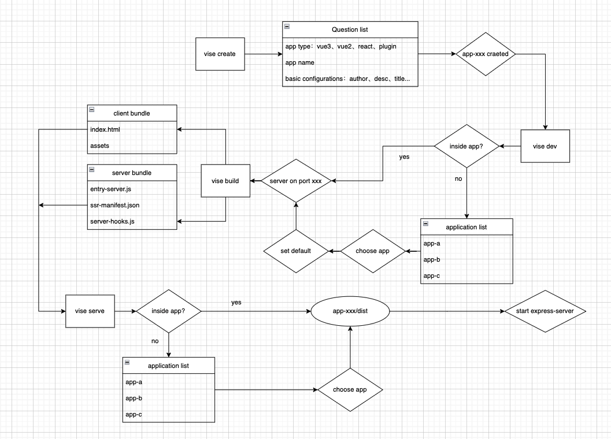

Vise provides command line tool to support the whole life cycle of SSR app development which includes projects creating, developing, building and serving.

## Available commands

### vise create
Creating a project with starter template with interactive CLI prompts, currently support Vue3 and React.

### vise dev
Start vite develop server with SSR support.

### vise build
Build distribution of the SSR project, which has 3 bundles, with vite build:
- Server bundle: UI library server bundle for SSR render.
- Client bundle: UI library client bundle for browser loading.
- Vise hook bundle: Tapped functions with app's server-side logics in server life cycle vise hooks.

### vise serve
Start HTTP SSR service using [@vise-ssr/express-server](https://www.npmjs.com/package/@vise-ssr/express-server), support following options: 
#### Basic Usage
```shell
$ vise serve [options] <viseAppDir>
```
- 1. Direct calling `vise serve` in Vise app directory, remember calling `vise build` first.
```shell
$ vise serve 
  Directory structure:
  app-my-vise
    ├── dist
    │   ├── client
    │   └── server
    ├── package.json
    ├── src
    ...
  ```
- 2. `vise serve ./path/to/app-my-vise`: If Vise app directory is not current working directory, you can add it as the last parameter.
- 3. `vise serve ./path/to/vise-app-bundles`: passing directory with multiple bundles for running multiple projects at the same time.
```shell
$ vise serve ./path/to/vise-app-bundles
  Directory structure:
  vise-app-bundles
  ├── my-vise-app-a
  │   ├── client
  │   ├── server
  │   └── package.json
  ├── my-vise-app-b
  │   ├── client
  │   ├── server
  │   └── package.json
  ...
```

#### Options
```shell
  -p, --port <port>                 server listen port (default: "3000")
  -c, --enable-cache <trueOrFalse>  enable server cache (default: "true")
  -r, --repeat-render <times>       repeat ssr for benchmark test (default: "0")
```

## Vise Command-line tool design


