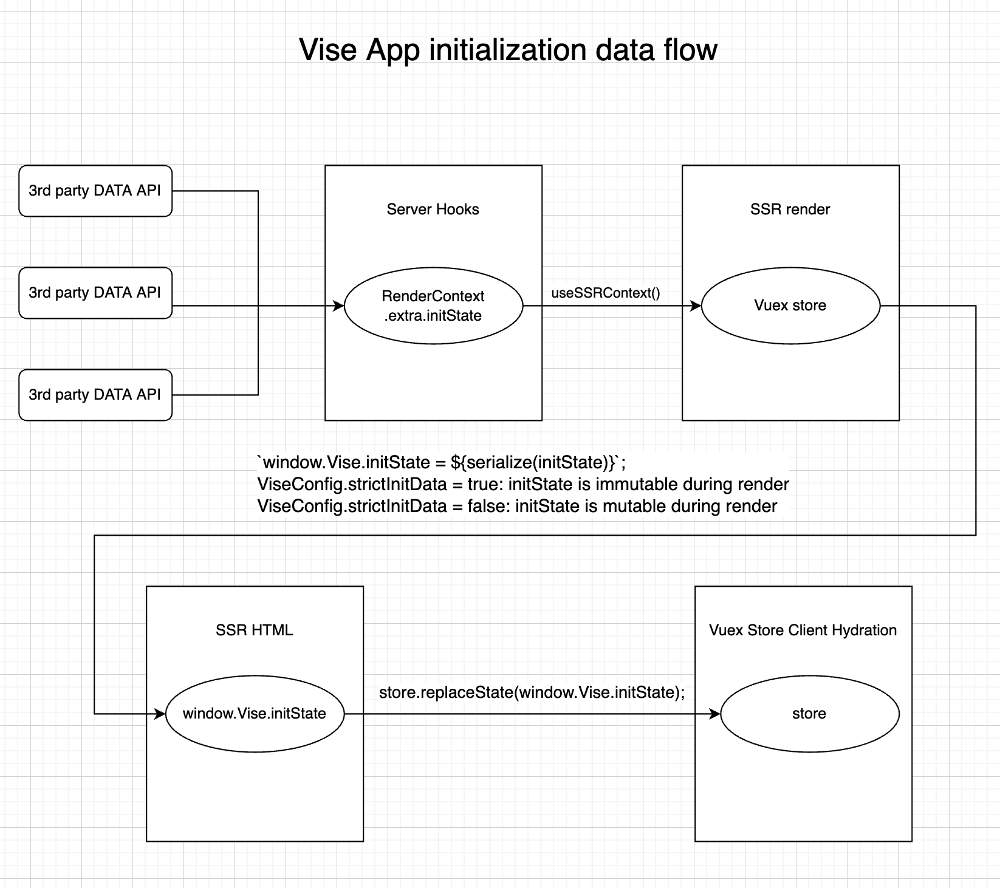

One the the most important topics in SSR is how to fetch the data needed for sever-side rendering, and how to transport that data to the client so that the page rendered in the server is isomorphic with client counterpart.

## Overall Design


## Data Flow
- For the data structure used in data transportation, please refer to [RenderContext](./key-data-types.html#rendercontext)
- **Data Fetch**: Needed data should be fetched in [tapable-hooks], normally in `beforeRender`. Because if fetch the data earlier, you may find the cache is available after an expensive data loading.
- **Store Data in RenderContext**: Fetched application initialization data should be should in `RenderContext.meta.initState`, all hooks in the downstream are able to access it from the context. It's worth to note that the initState should be a subset of the App's store's state, with a type of `DeepPartial<State>`. All data defined by Vise will be put in `RenderContext.meta` while other custom data in `RenderContext.extra`.
- **Access Data During Render**: Data in the `RenderContext.meta.initState` will be used to initialize the store of `<app>`, which is created with UI libraries such as React or Vue.
- **Update Data During Render**: During the render process, `<app>` may commit new data into the store. This may cause [hydration mismatch]. Vise introduces `strictInitState` config, mainly mean to rise the awareness of developers about the risk.
  - strictInitState: configured in `vise.config.ts` and set to true by default.  In the default strict mode, Vise will ignore all changed made to the store during render, make sure rendering start from exact same state in both server and client side.
- **Send Data to the Client**: Initial State of app will be transported as a JavaScript global variable: `window.Vise.initState`, embedded in a &lt;script&gt; tag in server-generated HTML.
- **Hydration on the client**: Vise will use the global variable to initialize the app's store, then try to [hydrate][hydration] the static html into a fully interactive app on the client.

### The Risk of disable strictInitState
Image there is a special component, the page header and page footer both use it. The component depends on a data in the store with the value of 'a'. During the rendering, someone changes the data in the store to 'b'. What will happen?

In a client side scenario, the change of data in the store will trigger another render, the outdated component in the header get updated.

But the SSR do NOT re-render! Once the header finishes rendering with the data of 'a', changing the store will not infect the generated HTML fragment, which leave the component in the header has a different view with the counterpart in the footer.

What will happen on the client side when this happens? If client app is initialized with the updated store, there will be a hydration mismatch because the component in the header will never match with a data not even in the store.

That's why Vise introduce `strictInitState` and set it to true by default. In the default mode, changes made to the store during the SSR will be ignored, to make sure both side start from the same point.

But sometimes you still want to keep the changed data, maybe because it is very expensive to get so you don't want to re-get it on the client. It is absolutely possible by setting `strictInitState` to false, and when you do that, you should know about the risk and make sure it's safe to do so.
### Communication between HTTP server and UI render bundle
The UI library render bundle can get data in RenderContext from SSRContext.

In Vue, SSRContext could be obtained with `useSSRContext`, changed properties in the context will be received by the HTTP server.

In React, SSRContext and a updateContext method will be passed as attributes of page component.

```typescript
// pages/my-page.vue
// ...
setup() {
  if (isSSR) {
    const { meta, extra } = useSSRContext();
    // access data in context.extra set by vise hooks
    console.log(extra.userAgent, extra.cookies);
    // communicate to HTTP server by changing data in meta & extra
    meta.title = 'My Page Title';
  }
}
// ...

//pages/my-page.tsx
//...
type MyPageProps = {
  ssrContext: {
    context: Pick<RenderContext, 'meta' | 'extra'>,
    updateContext: (context: Pick<RenderContext, 'meta' | 'extra'>) => void,
  }
};
function MyPage({ ssrContext: { context, updateContext } }: MyPageProps) {
  const { meta, extra } = context;
  // access data in context.extra set by vise hooks
  console.log(extra.userAgent, extra.cookies);
  // communicate to HTTP server by calling updateContext
  updateContext({
    extra,
    meta: Object.assign(meta, {
      title: 'My Page Title',
    })
  });
}
// ...
```
If you need to control the overall HTML generation from UI library render bundle, please refer to [Control HTML generation from UI render bundle](./server-api.html#Control-HTML-generation-from-UI-render-bundle).

[hydration]: <https://vuejs.org/guide/scaling-up/ssr.html#client-hydration>
[hydration mismatch]: <https://vuejs.org/guide/scaling-up/ssr.html#hydration-mismatch>
[tapable-hooks]: <./tapable-hooks.html>
