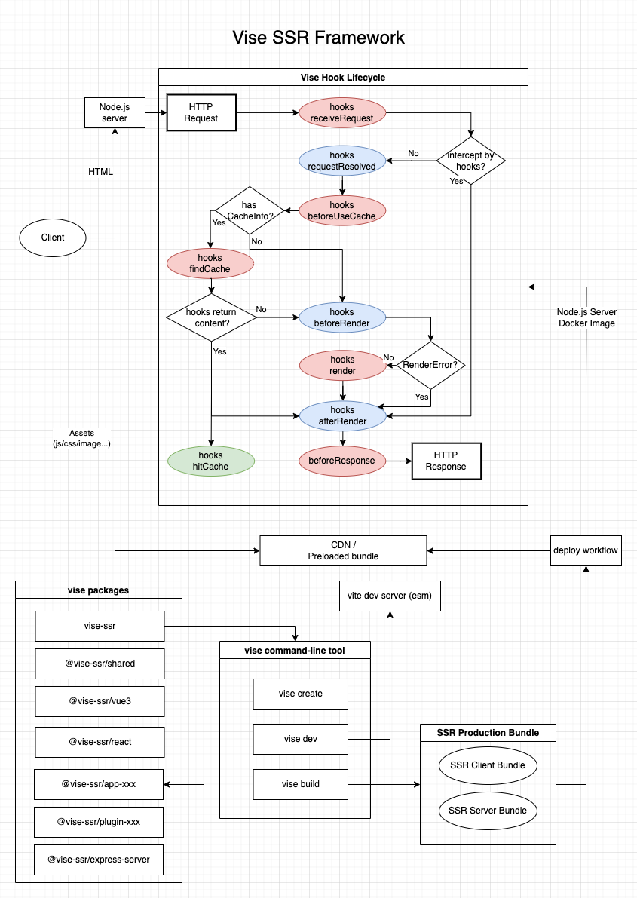
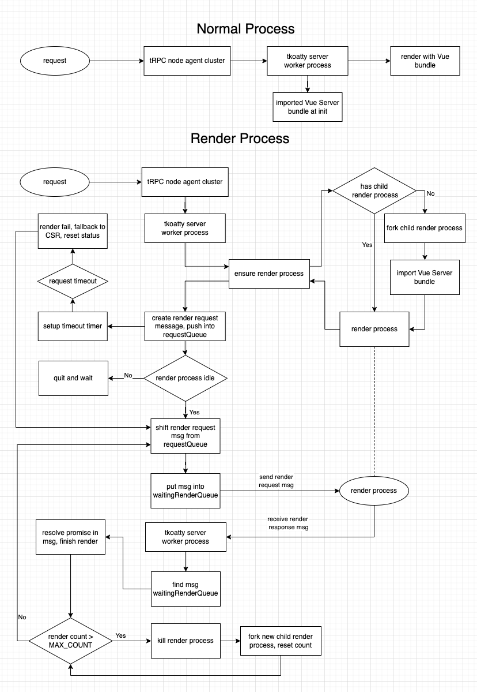
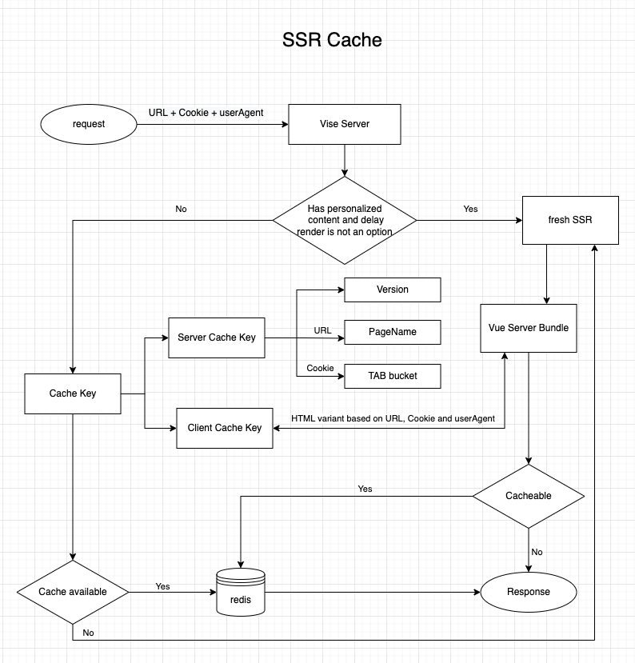

> Isomorphic SSR framework based on Vite

## Background
Vise (pronounced [vaɪs]) is an isomorphic Web SSR framework based on [Vite][vite], dedicated to provide an out of the box SSR develop experience as easy as SPA. It can work with multiple web user interface libraries such as React, Vue. By abstract app specific logic into server hooks, multiple apps could be deployed onto the same server and multiple hooks could be combined as special purpose hooks plugins. 

- Commandline: `create, dev, build, serve` commands to cover the whole dev cycle of web apps.
- Server Hooks: There are 9 [tapable-hooks](./tapable-hooks.html) in which app specific server logic could be defined in, so multiple apps could be deployed on the same server.
- React & Vue3: Currently web user interface libraries such as [React](https://www.npmjs.com/package/@vise-ssr/react), [Vue3](https://www.npmjs.com/package/@vise-ssr/vue3) are supported. And more are coming.
- HTTP Server: By default [Express](https://expressjs.com/) is used as the HTTP server for SSR, more servers such as Koa.js, Nest.js will be supported in the near future.
- Full esm & typescript support

## Design

[vite]: <https://vitejs.dev/>
