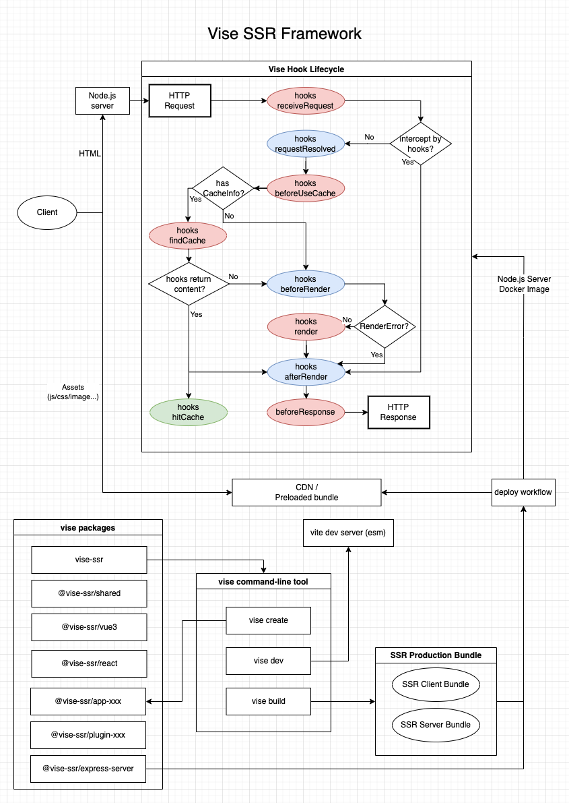
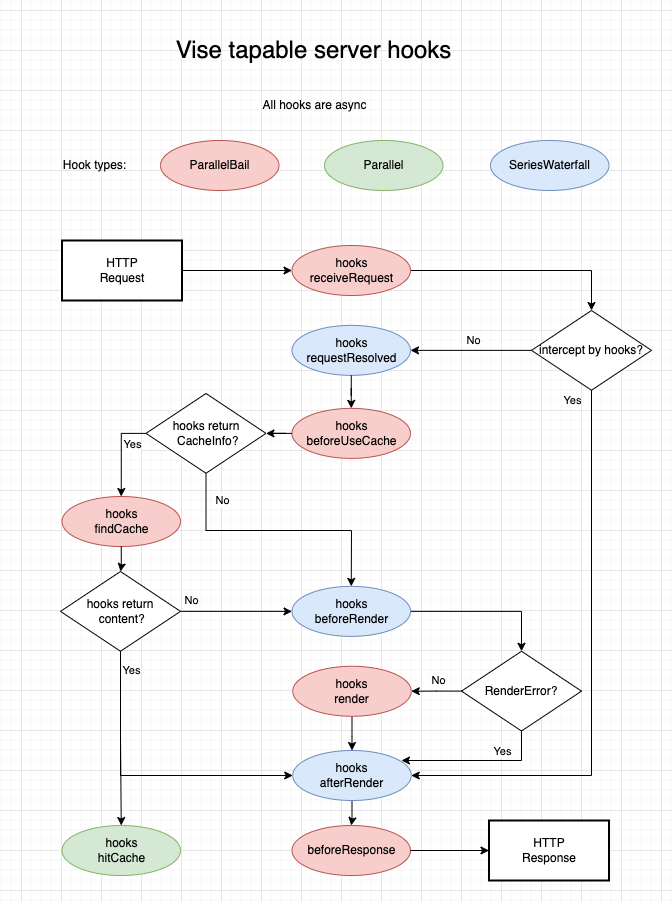
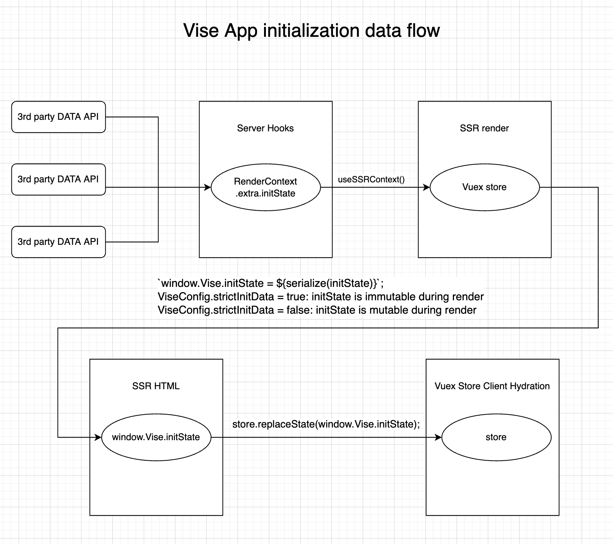
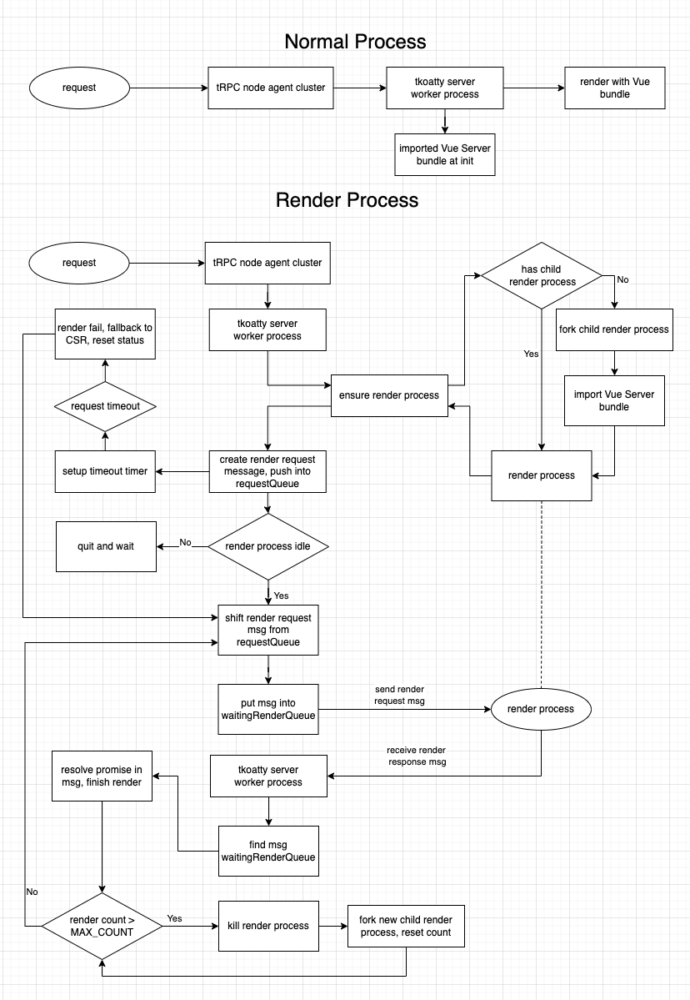
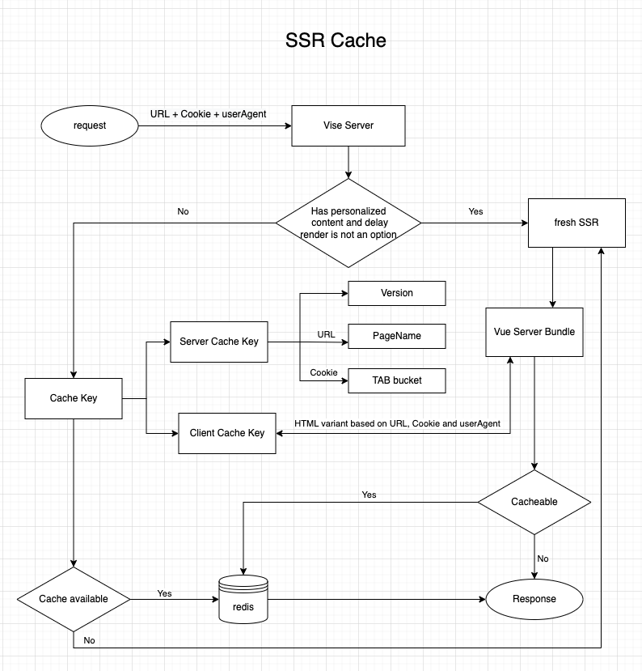

# vise-ssr 

## 背景
Vise 读音[vaɪs]，是一个同构 SSR 开发框架，致力于打造开箱即用的同构 Web 页面开发体验。通过插件化方式，支持任意服务端框架与任意前端框架的组合使用。使用基于 esm、速度更快的 vite 代替常见 Webpack 作为开发构建工具，提供命令行工具支持一站式的开发、构建、发布 Web 应用，让业务项目可以关注在业务功能实现上。项目基于全方位 ESM 及 TypeScript。

Vise 将服务端渲染拆分为多个核心阶段，为每个阶段提供了基于 tapable 的 hooks，不管是服务端实现方、业务 app 实现方还是插件实现方，都可以将自己的逻辑通过 hooks 扩展纳入。Vise 同时基于 hooks 提供了可重用的 plugin 插件。

## 整体设计

